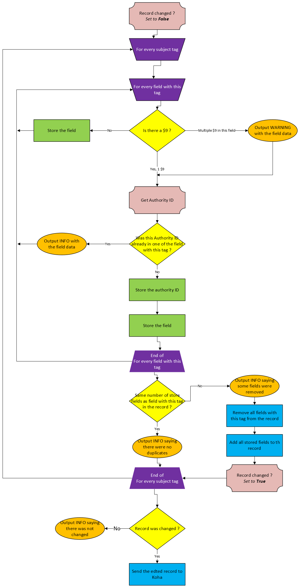
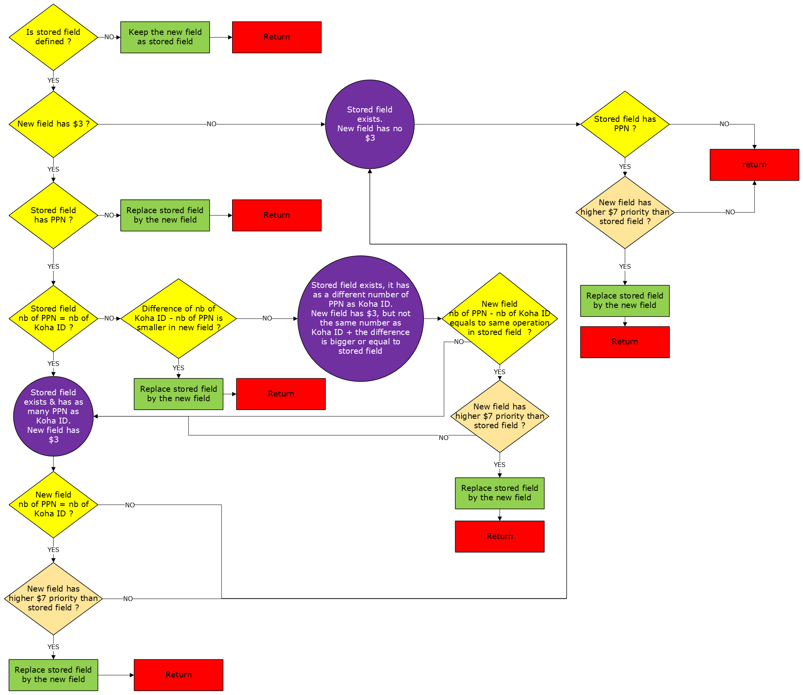

# Remove duplicate subject fields from Koha records

[](https://gist.github.com/cheerfulstoic/d107229326a01ff0f333a1d3476e068d)

This application is used to remove duplicate subject fields from MARC bibliographic records using Koha 23.11 REST APIs (works with 24.11).

An additional script (`prep_list.py`) filters the result of a SQL report merging in one column all the authority IDs, outputing the list of of biblionumber containing duplicates authorities ID.

## Requirements

* Uses `pymarc` 5.2.0

Included in the repository :

* [`Alban-Peyrat/Koha_API_interface/Koha_REST_API_Client.py`](https://github.com/Alban-Peyrat/Koha_API_interface/blob/main/Koha_REST_API_Client.py) 2025-02-18 version)
* [`Alban-Peyrat/Find_and_Compare_Records/func_file_check.py`](https://github.com/Alban-Peyrat/Find_and_Compare_Records/blob/master/func_file_check.py) (from version 2.0.1)
* [`Alban-Peyrat/Pymarc_utils/marc_utils_5.py`](https://github.com/Alban-Peyrat/Pymarc_utils/blob/main/marc_utils_5.py) (2024-12-13 version)
* `Alban-Peyrat/IPRAUS_integration/cl_log.py` (2024-11-21 version), based on `Archires_Auto_Koha_Report` 2024-09-25 version (based on FCR version 2.0.1)

## Environment variables

For `main.py` :

* Processing settings :
  * `SUBJECTS_TAG` : tags to check, as a list of ints, using `,` as separator
  * `RECORD_NB_LIMIT` : maximum number of record to process. Defaults to `500`
* Koha API settings :
  * `KOHA_URL` : Koha intranet domain name
  * `KOHA_CLIENT_ID` : Koha Client ID of an account with `catalogue` permission
  * `KOHA_CLIENT_SECRET` : Koha Client secret of an account with `catalogue` permission
* File settings :
  * `LOGS_FOLDER` : path to the folder containing the log file (file will be nammed `Koha_Remove_Subjects_Dupes.log`)
  * `LOG_LEVEL` : logging level to use : `DEBUG`, `INFO`, `WARNING`, `ERROR`, `CRITICAL` (`INFO` by default)
  * `INPUT_FILE` : input file containing a list of iblionumbers separated by line feed
  * `OUTPUT_PATH` : path to the folder containing the output files

For `prep_list.py` :

* `PREP_LIST_INPUT_FILE` : path to the file containing an extract of Koha data, needs columns `biblionumber` and `subfield` (see introduction for a report example)
* `PREP_LIST_OUTPUT_FILE` : path to the output file
* `PREP_LIST_FIELD_SEPARATOR` : separator between fields in `subfield`

## Script processing

### Effects of the script

_Note : the storing field process in the following flowchart is outdated, see the 2nd flowchart for the updated version_



**Storing the field**



### Output files

_Note : all CSV files use `;` as separator._

`KRSD_update_bibnb.txt` contains all biblionumber that were actually updated.

`KRSD_deleted_fields.csv` contains all deleted fields, with columns :

* `bibnb` : biblinoumber of the record
* `index` : index of the record in the input file
* `tag` : tag of the deleted field
* `auth_id` : authority ID of the deleted field
* `field` : the entire field as a string
* `replaced_by` : the entire field used as a replacement as a string

`KRSD_deleted_fields.csv` contains all errors or unexpected situation, with columns :

* `error_type` : the error type
  * `AUTH_ID_HAS_NO_CURRENT_FIELD` : the internal element used to store fields does not have a field for this authority ID
  * `BIBNB_IS_INCORRECT` : biblionumber is incorrect (not a positive integer)
  * `FAILED_TO_PARSE_MARC` : failed to parse the record
  * `NO_BIBNB_IN_RECORD` : record does not have a `001` (as those are records retrieved from Koha, all should have one)
  * `NO_RECORD` : record is empty / invalid
  * `RECORD_WAS_NOT_CHANGED` : the record did not change (as the script should only be used on records that should change)
  * `REQUESTS_GET_ERROR` : an error happenned while trying to retrieve the record. The message will have the name of the error
  * `WARNING_FIELD_WITHOUT_AUTHORITY_ID` : warning (not an error), one of the analysed field did not have authority ID
  * `WARNING_MULTIPLE_AUTHORITY_ID_IN_ONE_FIELD` : warning (not an error), one of the analysed field had multiple autority ID
  * `SECURITY_STOP` : the maximum number of records was reached
* `index` : index of the record in the input file
* `bibnb` : biblinoumber of the record
* `message` : aditional message if necessary, errors (or warnings) on specific fields usually have the entire field as a string

## SQL examples for `prep_list.py`

<!-- report ID 1500 -->

<!-- 
Pour les champs venant ud Sudoc, on peut exclure le snotices qui contiendrait des subdivisions
WHERE ExtractValue(metadata, CONCAT('count(//datafield[@tag="',  TRIM(<<Field Tag>>), '"]/subfield[@code="y"])')) = 0
	AND ExtractValue(metadata, CONCAT('count(//datafield[@tag="',  TRIM(<<Field Tag>>), '"]/subfield[@code="x"])')) = 0

 -->

```SQL
/* Simple, but will have false positives if multiples authority IDs can be present in the same field*/
SELECT biblionumber,
    ExtractValue(metadata, CONCAT('//datafield[@tag="',  TRIM(<<Field Tag>>), '"]/subfield[@code="', TRIM(<<Subfield Code>>), '"]')) AS subfield

FROM biblio_metadata
```

<!-- report ID 1740 -->

``` SQL
/* If fields can have multiples authority IDs, */
SELECT biblionumber,
    TRIM(BOTH <<Field separator (pas < ou >) >> FROM REGEXP_REPLACE(
        REGEXP_REPLACE(
            REGEXP_REPLACE(
                REGEXP_REPLACE(
                    REGEXP_REPLACE(
                        REGEXP_REPLACE(
                            REGEXP_REPLACE(
                                REGEXP_REPLACE(
                                    REGEXP_REPLACE(
                                        REGEXP_REPLACE(
                                            bm.metadata,
                                            /* Replace \n by spaces */
                                            "\n",
                                            " "
                                        ),
                                        /* Clear white spaces between tags */
                                        ">\\s*<",
                                        "><"
                                    ),
                                    /* Remove all datafields with wrong tag */
                                    CONCAT('<datafield tag="(?!', TRIM(<<Field Tag>>), ').*?<\/datafield>'),
                                    ""
                                ),
                                /* Remove all non-datafield*/
                                '.*?(<datafield.*<\/datafield>).*',
                                "\\1"
                            ),
                            /* Remove all subfields with wrong tag */
                            CONCAT('<subfield code="[^', TRIM("$" FROM TRIM(<<Subfield Code>>)), ']">.*?<\/subfield>'),
                            ""
                        ),
                        /* Replaces subfields tags with infield separator */
                        '<\/subfield><subfield code=".">',
                        TRIM(<<Infield separator (pas < ou >) >>)
                    ),
                    /* Replaces datafield tags with field separator */
                    '<\/datafield><datafield tag="\\d+" ind1="." ind2=".">',
                    TRIM(<<Field separator (pas < ou >) >>)
                ),
                /* Removes all remaining tags*/
                '<\/?.+?>',
                ""
            ),
            /* Remove infield separator if multiples occurrences next to each other */
            CONCAT(TRIM(<<Infield separator (pas < ou >) >>), "+"),
            TRIM(<<Infield separator (pas < ou >) >>)
        ),
        /* Remove field separator if multiples occurrences next to each other */
        CONCAT(TRIM(<<Field separator (pas < ou >) >>), "+"),
        TRIM(<<Field separator (pas < ou >) >>)
    )) as subfield
FROM biblio_metadata bm
WHERE ExtractValue(bm.metadata,
        CONCAT(
            '//datafield[@tag="',
            TRIM(<<Field Tag>>),
            '"]/subfield[@code="',
            TRIM("$" FROM TRIM(<<Subfield Code>>)),
            '"]'
        )
    ) != ""
```
